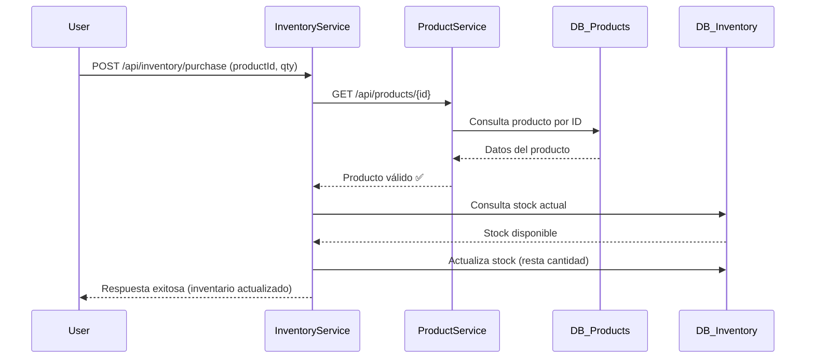
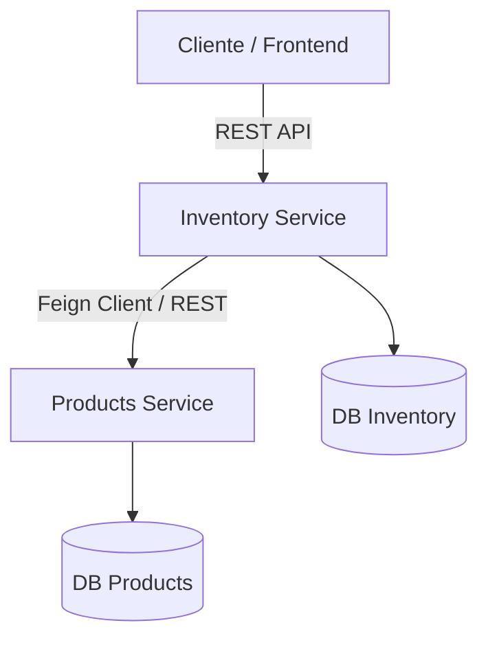

# 🏪 LinkTic Test – Microservicios de Productos e Inventario

Proyecto desarrollado como parte de la prueba técnica para **LinkTic**.  
Implementa una arquitectura basada en **microservicios con Spring Boot**, donde cada servicio tiene responsabilidades separadas y comunicación entre ellos vía REST.

---

## 🚀 1. Instrucciones de instalación y ejecución

### ✅ Requisitos previos

- **Java 17 o superior**
- **Apache Maven 3.9+**
- **Docker** (opcional)
- **Git**

---

### 🧩 Clonar el repositorio

```bash
git clone https://github.com/<tu-usuario>/LinkTic-Test.git
cd LinkTic-Test
```

---

### ⚙️ Compilar y ejecutar los servicios

Cada microservicio es independiente y tiene su propio `pom.xml`.

#### 📦 Products Service

```bash
cd products-service
mvn clean package
mvn spring-boot:run
```

Disponible en:

```
http://localhost:8081/api/products
```

#### 📦 Inventory Service

```bash
cd ../inventory-service
mvn clean package
mvn spring-boot:run
```

Disponible en:

```
http://localhost:8082/api/inventory
```

---

### 🧪 Ejecutar pruebas unitarias

Desde la raíz o desde cualquier módulo:

```bash
mvn test
```

Los resultados de cobertura se generan automáticamente en `target/surefire-reports`.

---

### 🐳 Ejecución con Docker

Cada servicio puede contener su propio `Dockerfile`.  
Ejemplo:

```bash
docker build -t products-service .
docker run -p 8081:8081 products-service
```

También se proporciona un archivo docker-compose.yml en la raíz del proyecto para levantar ambos microservicios junto con sus bases de datos de manera simultánea:

```bash
# Construir y ejecutar todos los servicios y bases de datos
docker-compose up --build
```

el sistema en local levantara el microservicio de productos en el puerto 8081 y el microservicio de inventario en el 8082

---

## 🏗️ 2. Descripción de la arquitectura

El sistema está compuesto por **dos microservicios principales** que se comunican entre sí mediante HTTP REST.

| Servicio              | Puerto | Responsabilidad principal                               |
| --------------------- | ------ | ------------------------------------------------------- |
| **products-service**  | `8081` | Gestión de productos (crear, listar, consultar por ID). |
| **inventory-service** | `8082` | Gestión de inventario y control de existencias.         |

Cada microservicio tiene:

- Su propia base de datos (MySQL).
- Capa de persistencia con **Spring Data JPA**.
- Capa de negocio con **servicios (Service)**.
- Capa de exposición **REST (Controller)**.
- Cobertura de pruebas unitarias e integración con **JUnit 5 + Mockito**.
- Manejo centralizado de errores.

---

## ⚙️ 3. Decisiones técnicas y justificaciones

### 🧱 Arquitectura

Se eligió **una arquitectura de microservicios** para garantizar:

- **Escalabilidad independiente** de cada módulo.
- **Mantenibilidad** al separar las responsabilidades.
- **Despliegue desacoplado** entre los servicios.

### 🔗 Comunicación entre servicios

La comunicación se realiza mediante **REST** utilizando un **cliente Feign (ProductClient)** o **RestTemplate** desde `inventory-service` hacia `products-service` para validar la existencia del producto.

Se definio una api key dentro de las propiedades del proyecto, para estandares de seguridad en la comunicación de cada microservicio

Esta decisión simplifica la integración y evita dependencias directas entre bases de datos.

### 🗃️ Persistencia

Cada servicio usa su propia base de datos y entidades JPA.  
Esto refuerza la **independencia de datos** y sigue el principio de **bounded context** del diseño de dominios (DDD).

### 🛒 Endpoint de compra

El endpoint de compra se implementa en **inventory-service**, justificado porque:

- Es el servicio responsable de modificar existencias.
- El flujo de compra impacta únicamente al inventario.
- `products-service` solo contiene información estática del producto (nombre, descripción, precio).

Flujo del endpoint:

1. Valida existencia del producto vía `ProductClient`.
2. Verifica inventario actual.
3. Actualiza cantidad en stock.
4. Retorna la nueva cantidad disponible.

---

## 🔄 4. Diagrama de interacción entre servicios

### 🔹 Diagrama de secuencia



---

### 🔹 Diagrama de arquitectura general



---

## 🛍️ 5. Explicación del flujo de compra implementado

1. **El cliente** envía una solicitud de compra a `/api/inventory/purchase` indicando el `productId` y la `cantidad`.
2. **InventoryService** consulta al **ProductService** para verificar que el producto existe.
3. Si el producto **no existe**, se devuelve un error **404 NOT FOUND**.
4. Si existe:
   - Se obtiene o crea el registro de inventario.
   - Se descuenta la cantidad comprada del stock disponible.
   - Se guarda el nuevo estado en la base de datos.
   - Se devuelve la respuesta con el inventario actualizado y estado **200 OK**.

Este flujo garantiza **consistencia de datos** y **aislamiento de responsabilidades** entre servicios.

---

## 🤖 6. Uso de herramientas de IA en el desarrollo

Durante el desarrollo se utilizaron herramientas de inteligencia artificial para **acelerar la codificación** y **mejorar la calidad** del código.

| Herramienta         | Uso específico                                                                                                     | Verificación de calidad                                                                   |
| ------------------- | ------------------------------------------------------------------------------------------------------------------ | ----------------------------------------------------------------------------------------- |
| **ChatGPT (GPT-5)** | Generación inicial de servicios, controladores y pruebas unitarias. Asistencia en refactorización y documentación. | Validación manual mediante pruebas unitarias (`mvn test`) y revisión de estilo de código. |
| **GitHub Copilot**  | Autocompletado de métodos repetitivos y anotaciones JPA.                                                           | Se revisaron todas las sugerencias antes de integrarlas.                                  |

La IA fue usada como **asistente de productividad**, no como reemplazo del juicio técnico.  
Todas las piezas de código generadas fueron **revisadas, validadas y probadas manualmente**.

---

## 🧾 7. Buenas prácticas implementadas

- Patrón **Controller → Service → Repository**.
- Manejo centralizado de excepciones con `ResponseStatusException`.
- Respuestas JSON estructuradas.
- Arquitectura limpia y modular.

---

## 🧰 8. Estructura de carpetas del proyecto

```
LinkTic-Test/
│
├── products-service/
│   ├── src/
│   │   ├── main/java/com/carlosmoreno/store/products_service/
│   │   │   ├── controller/
│   │   │   ├── model/
│   │   │   ├── repository/
│   │   │   ├── service/
│   │   └── test/java/com/carlosmoreno/store/products_service/
│   │       ├── controller/
│   │       ├── service/
│   │       └── integration/
│   └── pom.xml
│
├── inventory-service/
│   ├── src/
│   │   ├── main/java/com/carlosmoreno/store/inventory_service/
│   │   │   ├── client/
│   │   │   ├── controller/
│   │   │   ├── model/
│   │   │   ├── repository/
│   │   │   └── service/
│   │   └── test/java/com/carlosmoreno/store/inventory_service/
│   │       ├── controller/
│   │       └── service/
│   └── pom.xml
│
├── .gitignore
└── README.md
```

## 📄 8. Licencia

Este proyecto se distribuye bajo la licencia **MIT**.  
Desarrollado por **Carlos Moreno** – 2025.
